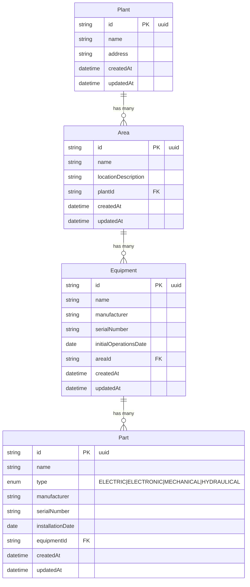

# Opwell Asset Management System

A full-stack application for managing industrial assets, built with Node.js, Express, TypeORM, and Next.js.

> **Note**: This project serves as a technical challenge for candidates applying to Opwell.

# Introduction

Opwell is a company focused on empowering the industrial sector through advanced technology and AI-driven solutions. One of its core services is asset management, which involves maintaining an accurate and structured inventory of industrial facilities, equipment, and parts, along with the necessary documentation for effective maintenance and operation.

This repository contains a sample application designed to simulate that functionality. It allows users to manage an inventory of:

- Plants – physical sites or facilities
- Areas – subdivisions within plants
- Equipment – machines or devices located in areas
- Parts – electrical, electronic, mechanical, or hydraulic components installed in equipment

Each of these entities is fully manageable through CRUD operations, and the application provides intuitive filtering and navigation between them. The frontend is built with Next.js and styled using Ant Design, while the backend uses Node.js, Express, and TSOA to expose a typed REST API.

This project demonstrates how asset data can be modeled and interacted with in a scalable, maintainable way—an important step toward smarter, more efficient industrial operations.

## Requirements

- Node.js v20 or higher
- Yarn package manager

## Overview

This application provides a comprehensive solution for managing industrial assets across multiple plants. It allows users to track plants, areas within plants, equipment within areas, and parts within equipment. The system supports CRUD operations for all entities and provides filtering capabilities to easily find specific assets.

## Architecture

The application follows a modern full-stack architecture:

- **Backend**: Node.js with Express, TypeORM for database operations, and TSOA for API generation
- **Frontend**: Next.js with React, Ant Design for UI components, and React Query for data fetching
- **Database**: SQLite (for simplicity, can be replaced with PostgreSQL or MySQL for production)

## Features

- **Dashboard**: Overview of all assets with quick access to detailed views
- **CRUD Operations**: Create, read, update, and delete all entities
- **Filtering**: Filter assets by various properties
- **Navigation**: Seamless navigation between related entities (e.g., from plants to areas)
- **Responsive Design**: Works on desktop and mobile devices

## Backend Implementation

### Technologies

- **Node.js**: Runtime environment
- **Express**: Web framework
- **TypeORM**: Object-Relational Mapping (ORM) for database operations
- **TSOA**: TypeScript OpenAPI for API generation
- **SQLite**: Database (for development, can be replaced with PostgreSQL or MySQL)
- **TypeScript**: Programming language

### Project Structure

```
backend/
├── src/
│   ├── config/         # Configuration files (database, seed data)
│   ├── controllers/    # API controllers
│   ├── models/         # Database models
│   ├── routes/         # Auto-generated routes
│   └── index.ts        # Application entry point
├── tests/              # Test files
├── package.json        # Dependencies and scripts
├── tsconfig.json       # TypeScript configuration
└── tsoa.json           # TSOA configuration
```

### API Documentation

The API documentation is available at `/docs` when the server is running. It provides detailed information about all available endpoints, request/response formats, and data models.

### Setup and Running

1. Install dependencies:

   ```bash
   cd backend
   yarn install
   ```

2. Start the development server:

   ```bash
   yarn dev
   ```

3. Build for production:

   ```bash
   yarn build
   ```

4. Start the production server:
   ```bash
   yarn start
   ```

## Frontend Implementation

### Technologies

- **Next.js**: React framework for server-rendered applications
- **React**: UI library
- **Ant Design**: UI component library
- **React Query**: Data fetching and state management
- **Axios**: HTTP client
- **TypeScript**: Programming language

### Project Structure

```
frontend/
├── src/
│   ├── app/            # Next.js app router pages
│   ├── components/     # Reusable React components
│   ├── lib/            # Utility functions and libraries
│   ├── services/       # API service functions
│   └── globals.css     # Global styles
├── public/             # Static assets
├── package.json        # Dependencies and scripts
└── tsconfig.json       # TypeScript configuration
```

### Pages

- **Dashboard**: Overview of all assets
- **Plants**: Manage plants
- **Areas**: Manage areas within plants
- **Equipment**: Manage equipment within areas
- **Parts**: Manage parts within equipment

### Setup and Running

1. Install dependencies:

   ```bash
   cd frontend
   yarn install
   ```

2. Start the development server:

   ```bash
   yarn dev
   ```

3. Build for production:

   ```bash
   yarn build
   ```

4. Start the production server:
   ```bash
   yarn start
   ```

## Data Models

### Plant

| Field     | Type     | Description           |
| --------- | -------- | --------------------- |
| id        | UUID     | Primary key           |
| name      | String   | Name of the plant     |
| address   | String   | Physical address      |
| areas     | Relation | One-to-many with Area |
| createdAt | DateTime | Creation timestamp    |
| updatedAt | DateTime | Last update timestamp |

### Area

| Field               | Type     | Description                |
| ------------------- | -------- | -------------------------- |
| id                  | UUID     | Primary key                |
| name                | String   | Name of the area           |
| locationDescription | String   | Area description           |
| plant               | Relation | Many-to-one with Plant     |
| plantId             | UUID     | Foreign key to Plant       |
| equipment           | Relation | One-to-many with Equipment |
| createdAt           | DateTime | Creation timestamp         |
| updatedAt           | DateTime | Last update timestamp      |

### Equipment

| Field                 | Type     | Description              |
| --------------------- | -------- | ------------------------ |
| id                    | UUID     | Primary key              |
| name                  | String   | Name of the equipment    |
| manufacturer          | String   | Equipment manufacturer   |
| serialNumber          | String   | Equipment serial number  |
| initialOperationsDate | Date     | Start date of operations |
| area                  | Relation | Many-to-one with Area    |
| areaId                | UUID     | Foreign key to Area      |
| parts                 | Relation | One-to-many with Part    |
| createdAt             | DateTime | Creation timestamp       |
| updatedAt             | DateTime | Last update timestamp    |

### Part

| Field            | Type     | Description                            |
| ---------------- | -------- | -------------------------------------- |
| id               | UUID     | Primary key                            |
| name             | String   | Name of the part                       |
| type             | Enum     | Part type (IT/OIL_AND_GAS/AGRICULTURE) |
| manufacturer     | String   | Part manufacturer                      |
| serialNumber     | String   | Part serial number                     |
| installationDate | Date     | Installation date                      |
| equipment        | Relation | Many-to-one with Equipment             |
| equipmentId      | UUID     | Foreign key to Equipment               |
| createdAt        | DateTime | Creation timestamp                     |
| updatedAt        | DateTime | Last update timestamp                  |

## Database Schema



The diagram shows the relationships between the main entities in the system:

- A **Plant** can have multiple **Areas**
- An **Area** can have multiple pieces of **Equipment**
- A piece of **Equipment** can have multiple **Parts**

Each entity has timestamps (`createdAt` and `updatedAt`) for auditing purposes. The relationships are enforced through foreign keys, ensuring data integrity across the system.

## API Routes

### Plants

- `GET /api/plants` - Get all plants
- `GET /api/plants/:id` - Get a specific plant
- `POST /api/plants` - Create a new plant
- `PUT /api/plants/:id` - Update a plant
- `DELETE /api/plants/:id` - Delete a plant

### Areas

- `GET /api/areas` - Get all areas
- `GET /api/areas/:id` - Get a specific area
- `POST /api/areas` - Create a new area
- `PUT /api/areas/:id` - Update an area
- `DELETE /api/areas/:id` - Delete an area

### Equipment

- `GET /api/equipment` - Get all equipment
- `GET /api/equipment/:id` - Get a specific equipment
- `POST /api/equipment` - Create new equipment
- `PUT /api/equipment/:id` - Update equipment
- `DELETE /api/equipment/:id` - Delete equipment

### Parts

- `GET /api/parts` - Get all parts
- `GET /api/parts/:id` - Get a specific part
- `POST /api/parts` - Create a new part
- `PUT /api/parts/:id` - Update a part
- `DELETE /api/parts/:id` - Delete a part

## Part Types

- `IT` - Information Technology components
- `OIL_AND_GAS` - Oil and Gas industry components
- `AGRICULTURE` - Agricultural industry components

## Getting Started

1. Clone the repository
2. Install dependencies for both backend and frontend
3. Start the backend server
4. Start the frontend development server
5. Access the application at http://localhost:3000

## License

ISC
